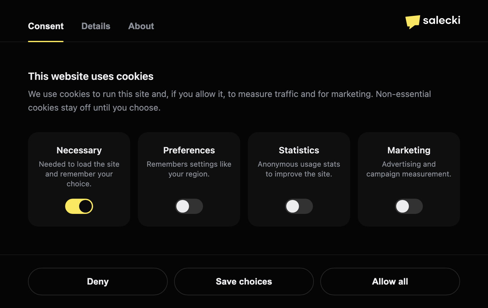
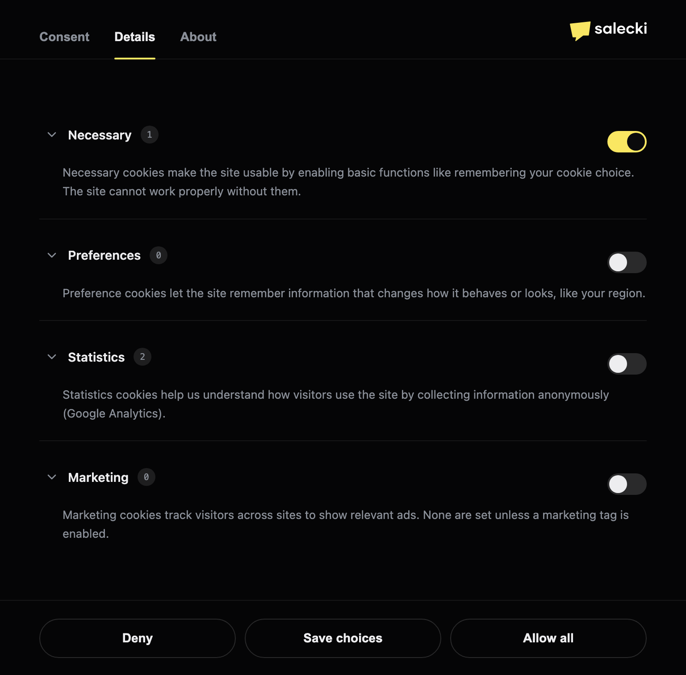
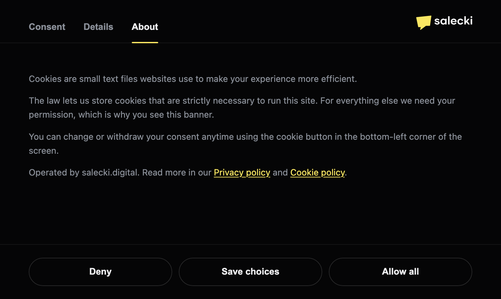

# consentric

[](https://github.com/msalecki/consentric/actions/workflows/ci.yml)
[](https://www.npmjs.com/package/consentric)
[](LICENSE)

**A self-contained, drop-in GDPR cookie consent banner for React — with Google Consent Mode v2 built in.**



Most cookie banners are either a paid SaaS widget that injects a third-party script
into your page, or a barebones snippet you have to wire up yourself. `consentric` is
neither: it's a single React component you import, style with a few props, and forget
about. No external scripts, no account, no runtime dependencies, no Tailwind — just one
component that ships its own styles and talks to Google Consent Mode for you.

It uses a familiar tabbed layout (Consent / Details / About, four categories, an
accordion of per-cookie details) so it feels instantly recognisable to your visitors,
while every string, colour, category and cookie table stays under your control.

```tsx
import { CookieConsent } from 'consentric';

export default function App() {
  return (
    <>
      {/* your app */}
      <CookieConsent company="salecki.digital" privacyUrl="/privacy" />
    </>
  );
}
```

That's the whole integration. On first visit it shows the banner; after a choice it
persists to a cookie and collapses to a small floating button so visitors can change
their mind anytime.

## Preview

The hero above is the **Consent** tab. The other two:

**Details** — every category's cookie table in an accordion.



**About** — a plain-language explainer plus your policy links.



Want to poke at it live? Spin up the playground — language picker plus light/dark themes:

```sh
npm install
npm run example   # opens http://localhost:5173
```

## Features

- **Google Consent Mode v2** — pushes `default` (all denied) on mount and `update` on
  the visitor's choice, mapping the four categories to the right Consent Mode signals.
- **Persistent & versioned** — the choice is stored in a cookie for one year and
  restored on the next visit; bumping the schema version re-prompts everyone.
- **Familiar tabbed UX** — Consent / Details / About tabs, four categories, a per-cookie
  accordion. Recognisable to visitors, nothing for you to design.
- **10 built-in languages** — English (default), German, French, Spanish, Italian,
  Portuguese, Dutch, Polish, Czech and Slovak, picked with one `locale` prop. Every
  category, cookie row and UI string is also overridable for any other language.
- **Accessible** — focus-trapped modal, focus restored on close, arrow-key tab
  navigation, full ARIA wiring, and `prefers-reduced-motion` support.
- **No dark patterns** — "Allow all" and "Deny" get equal visual weight, the way EU
  regulators expect a consent dialog to behave.
- **Works with Next.js** — ships as a Client Component (`"use client"`), so it drops
  straight into the App Router.
- **Zero dependencies, zero Tailwind** — styles are scoped and injected; colours come
  from props via CSS variables, so it drops into any React project and looks identical
  regardless of the host's styling.
- **Small & self-contained** — one component with all 10 languages, ~15 KB gzipped;
  ships ESM + CJS with types, `sideEffects: false`.

## Install

```sh
npm install consentric
```

`react >= 17` is a peer dependency.

## Usage

```tsx
import { CookieConsent } from 'consentric';

<CookieConsent
  company="salecki.digital"
  privacyUrl="/privacy"
  termsUrl="/privacy#cookies"
  colors={{ brand: '#FAE762', surface: '#050506', text: '#EDEDEF', onBrand: '#0a0a0c' }}
/>
```

With no props it renders the default dark theme and English copy. Render it once, near
the root of your app.

## Props

| Prop | Default | What it does |
|---|---|---|
| `manageDefault` | `true` | Push gtag consent `default` (all denied) on mount. Set `false` if you set it in `<head>` before GTM (strict timing — see below). |
| `cookieName` | `'site_consent'` | Consent cookie name. Must match the head/GTM snippet if you use one. |
| `company` | — | Operator / brand name shown in the header and About panel. |
| `logo` | — | Optional brand mark (an `<svg/>` or ``). |
| `privacyUrl` | `'/privacy'` | Privacy policy link. |
| `termsUrl` | `'/privacy#cookies'` | Cookie/terms link. |
| `locale` | `'en'` | Built-in language pack (`de`, `fr`, `es`, `it`, `pt`, `nl`, `pl`, `cs`, `sk`). English is the default and fallback; `pt-BR` resolves to `pt`. |
| `defaultOpen` | `false` | Open the dialog on mount even if a choice is stored (for previews/Storybook). |
| `defaultTab` | `'consent'` | Tab to show first: `consent` / `details` / `about`. |
| `colors` | dark theme | `{ brand, brandDeep, surface, surfaceAlt, text, textMuted, backdrop, onBrand }`. |
| `categories` | built-in EN | Per-category content overrides — see below. |
| `labels` | built-in EN | UI string overrides for localisation — see below. |
| `onChange` | — | `(choices) => void`, fired after the user makes or changes a choice. |
| `autoClearCookies` | `true` | When a category is denied or revoked, delete the cookies declared in its table (names support a trailing `*` wildcard). The consent cookie is never touched. |

## Customising categories & cookie tables

The four category keys are fixed (they map to Consent Mode signals), but their name,
descriptions and cookie list are yours. The count badge is derived from the cookie list,
so it always matches. Anything you omit falls back to the default.

```tsx
<CookieConsent
  categories={{
    statistics: {
      about: 'We use Plausible, a privacy-friendly analytics tool.',
      cookies: [
        { name: 'plausible_ignore', provider: 'Plausible', purpose: 'Excludes your own visits.', meta: 'localStorage' },
      ],
    },
    // necessary / preferences / marketing keep their defaults
  }}
/>
```

## Clearing cookies on withdrawal

When a visitor denies or later revokes a category, `consentric` deletes the cookies you
declared in that category's table — so the data actually leaves the browser, not just the
Consent Mode signal. Matching is by cookie name and supports a trailing `*` wildcard
(`_ga_*` clears `_ga_ABC123`), and the component tries the common path/domain combinations
so cookies set on the registrable domain (e.g. `.example.com`) are caught too.

Only cookies you list are ever removed, and the consent cookie itself is always kept. It's
on by default — pass `autoClearCookies={false}` to manage cleanup yourself.

## Localisation

`consentric` ships with **ten built-in languages** — English (the default and the
fallback for any missing string) plus nine more. Pick one with the `locale` prop and the
banner, categories and cookie tables are all translated:

```tsx
<CookieConsent company="salecki.digital" locale="pl" />
```

| Code | Language | Code | Language |
|---|---|---|---|
| `en` | English (default) | `pt` | Portuguese |
| `de` | German | `nl` | Dutch |
| `fr` | French | `pl` | Polish |
| `es` | Spanish | `cs` | Czech |
| `it` | Italian | `sk` | Slovak |

Region subtags are accepted — `locale="pt-BR"` resolves to `pt`. The full list is also
exported as `SUPPORTED_LOCALES`.

### Custom strings & other languages

For a language without a built-in pack — or to reword one — pass your own strings via
`labels` (and `categories`). They win over the locale pack, which in turn falls back to
English, so you can override just a key or two. The `operatedBy` and `readMore` templates
support `{company}`, `{privacy}` and `{cookie}` placeholders so word order works in any
language.

```tsx
<CookieConsent
  locale="de"
  labels={{
    // start from the German pack, just reword these two
    heading: 'Wir verwenden Cookies',
    deny: 'Nur notwendige',
  }}
/>
```

## Light theme

Defaults assume a dark `surface`. For a light theme, also set `onBrand` (the text/icon
colour on top of the primary button) so it keeps enough contrast.

```tsx
<CookieConsent
  colors={{
    brand: '#2563eb',
    brandDeep: '#1d4ed8',
    surface: '#ffffff',
    surfaceAlt: 'rgba(0,0,0,0.04)',
    text: '#0f172a',
    textMuted: '#64748b',
    backdrop: 'rgba(15,23,42,0.4)',
    onBrand: '#ffffff',
  }}
/>
```

## Strict Consent Mode timing (recommended)

For tags to be gated **before** GTM loads, set the default in `<head>` (before the
GTM snippet) and pass `manageDefault={false}`. The same snippet can go into a GTM
Custom HTML tag on the **Consent Initialization - All Pages** trigger. The cookie
name in that snippet must match `cookieName`. Full snippet is in the header of
[src/CookieConsent.tsx](src/CookieConsent.tsx). If you skip both, leave `manageDefault`
on — the component pushes the default on mount (fine for simple setups).

## License

MIT © [salecki.digital](https://salecki.digital)
