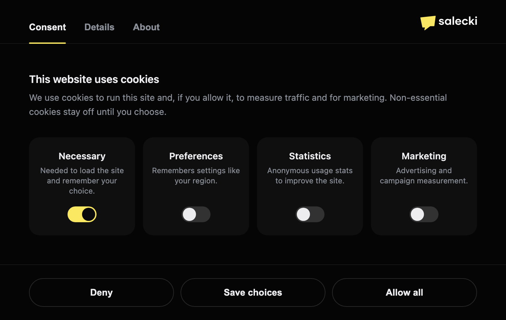
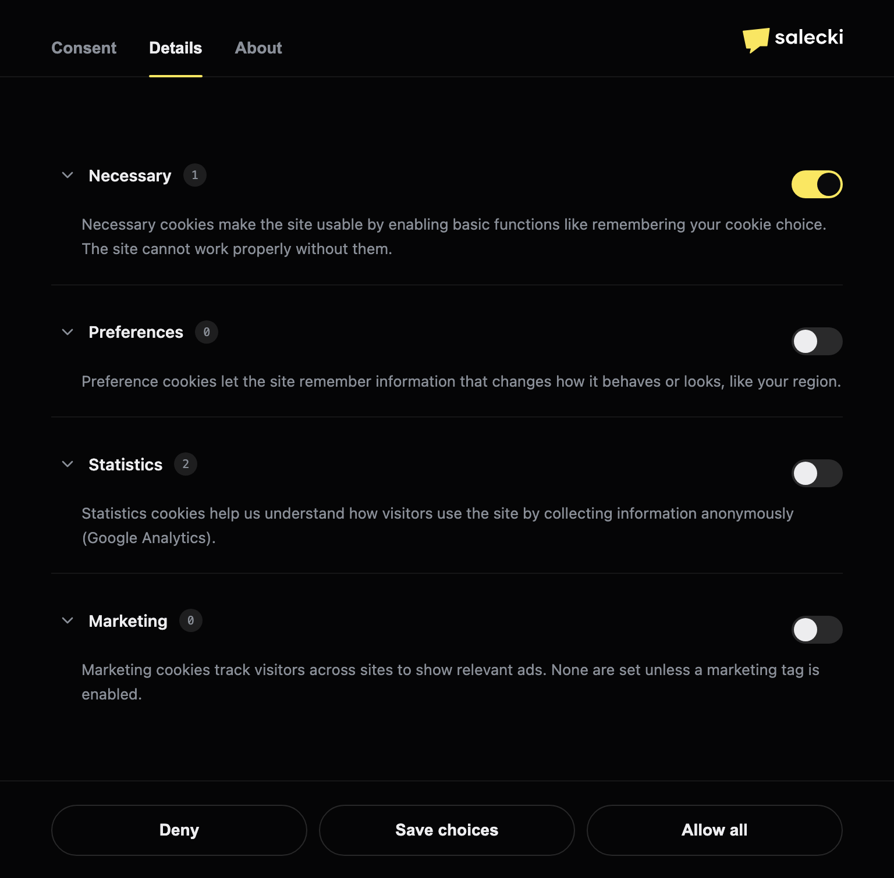
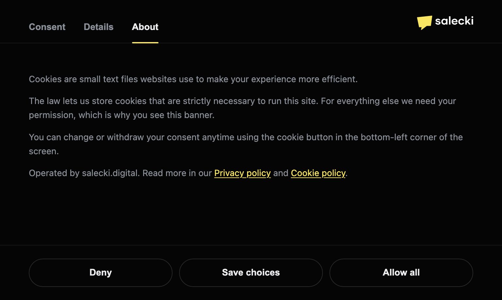

# consentric

[](https://github.com/msalecki/consentric/actions/workflows/ci.yml)
[](https://www.npmjs.com/package/consentric)
[](LICENSE)

**A self-contained, drop-in GDPR cookie consent banner for React — with Google Consent Mode v2 built in.**



Most cookie banners are either a paid SaaS widget that injects a third-party script
into your page, or a barebones snippet you have to wire up yourself. `consentric` is
neither: it's a single React component you import, style with a few props, and forget
about. No external scripts, no account, no runtime dependencies, no Tailwind — just one
component that ships its own styles and talks to Google Consent Mode for you.

It uses a familiar tabbed layout (Consent / Details / About, four categories, an
accordion of per-cookie details) so it feels instantly recognisable to your visitors,
while every string, colour, category and cookie table stays under your control.

```tsx
import { CookieConsent } from 'consentric';

export default function App() {
  return (
    <>
      {/* your app */}
      <CookieConsent company="salecki.digital" privacyUrl="/privacy" />
    </>
  );
}
```

That's the whole integration. On first visit it shows the banner; after a choice it
persists to a cookie and collapses to a small floating button so visitors can change
their mind anytime.

## Preview

The hero above is the **Consent** tab. The other two:

**Details** — every category's cookie table in an accordion.



**About** — a plain-language explainer plus your policy links.



Want to poke at it live? Spin up the playground — language picker plus light/dark themes:

```sh
npm install
npm run example   # opens http://localhost:5173
```

## Features

- **Google Consent Mode v2** — pushes `default` (all denied) on mount and `update` on
  the visitor's choice, mapping the four categories to the right Consent Mode signals.
- **Persistent & versioned** — the choice is stored in a cookie for one year and
  restored on the next visit; the stored value is versioned, so a future release can
  re-prompt everyone after a policy change.
- **Familiar tabbed UX** — Consent / Details / About tabs, four categories, a per-cookie
  accordion. Recognisable to visitors, nothing for you to design.
- **10 built-in languages** — English (default), German, French, Spanish, Italian,
  Portuguese, Dutch, Polish, Czech and Slovak, picked with one `locale` prop. Every
  category, cookie row and UI string is also overridable for any other language.
- **Light & dark** — follows the OS `prefers-color-scheme` by default; ships light and
  dark palettes, or pass your own (one for both themes, or `{ light, dark }`). Borders and
  fills derive from your `text` colour, so a light theme needs no host-CSS overrides.
- **Accessible** — focus-trapped modal, focus restored on close, arrow-key tab
  navigation, full ARIA wiring, and `prefers-reduced-motion` support.
- **No dark patterns by default** — "Allow all" and "Deny" get equal visual weight, the
  way EU regulators expect a consent dialog to behave. If you want the familiar
  emphasised "Allow all", opt in with `primaryAction="allowAll"`.
- **Works with Next.js** — ships as a Client Component (`"use client"`), so it drops
  straight into the App Router.
- **Zero dependencies, zero Tailwind** — styles are scoped and injected; colours come
  from props via CSS variables, so it drops into any React project and looks identical
  regardless of the host's styling.
- **Small & self-contained** — one component with all 10 languages, ~16 KB gzipped;
  ships ESM + CJS with types, `sideEffects: false`.

## Install

```sh
npm install consentric
```

`react >= 17` is a peer dependency.

## Usage

```tsx
import { CookieConsent } from 'consentric';

<CookieConsent
  company="salecki.digital"
  privacyUrl="/privacy"
  termsUrl="/privacy#cookies"
  colors={{ brand: '#FAE762', surface: '#050506', text: '#EDEDEF', onBrand: '#0a0a0c' }}
/>
```

With no props it renders the default dark theme and English copy. Render it once, near
the root of your app.

## Props

| Prop | Default | What it does |
|---|---|---|
| `manageDefault` | `true` | Push gtag consent `default` (all denied) on mount. Set `false` if you set it in `<head>` before GTM (strict timing — see below). |
| `cookieName` | `'site_consent'` | Consent cookie name. Must match the head/GTM snippet if you use one. |
| `company` | — | Operator / brand name shown in the header and About panel. |
| `logo` | — | Optional brand mark (an `<svg/>` or ``). A single node, or `{ light, dark }` to swap it by theme. |
| `privacyUrl` | `'/privacy'` | Privacy policy link. |
| `termsUrl` | `'/privacy#cookies'` | Cookie/terms link. |
| `locale` | `'en'` | Built-in language pack (`de`, `fr`, `es`, `it`, `pt`, `nl`, `pl`, `cs`, `sk`). English is the default and fallback; `pt-BR` resolves to `pt`. |
| `defaultOpen` | `false` | Open the dialog on mount even if a choice is stored (for previews/Storybook). |
| `defaultTab` | `'consent'` | Tab to show first: `consent` / `details` / `about`. |
| `theme` | `'auto'` | `'auto'` follows the OS `prefers-color-scheme` (and re-renders on change); `'light'` / `'dark'` pin it. |
| `colors` | light + dark | One palette (applied to both themes) **or** `{ light, dark }`. See [Light & dark themes](#light--dark-themes). |
| `categories` | built-in EN | Per-category content overrides — see below. |
| `labels` | built-in EN | UI string overrides for localisation — see below. |
| `primaryAction` | `'save'` | Which button gets brand emphasis: `'save'` (only once a category is on — equal-weight otherwise), `'allowAll'` (always), or `'none'`. |
| `deferOpen` | `true` | Defer the first-visit auto-open past first paint (avoids Lighthouse `NO_LCP`). Ignored when `defaultOpen`. |
| `fontFamily` | system stack | Override the font stack. |
| `onChange` | — | `(choices) => void`, fired after the user makes or changes a choice. |
| `autoClearCookies` | `true` | When a category is denied or revoked, delete the cookies declared in its table (names support a trailing `*` wildcard). The consent cookie is never touched. |

## Customising categories & cookie tables

The four category keys are fixed (they map to Consent Mode signals), but their name,
descriptions and cookie list are yours. The count badge is derived from the cookie list,
so it always matches. Anything you omit falls back to the default.

```tsx
<CookieConsent
  categories={{
    statistics: {
      about: 'We use Plausible, a privacy-friendly analytics tool.',
      cookies: [
        { name: 'plausible_ignore', provider: 'Plausible', purpose: 'Excludes your own visits.', meta: 'localStorage' },
      ],
    },
    // necessary / preferences / marketing keep their defaults
  }}
/>
```

## Clearing cookies on withdrawal

When a visitor denies or later revokes a category, `consentric` deletes the cookies you
declared in that category's table — so the data actually leaves the browser, not just the
Consent Mode signal. Matching is by cookie name and supports a trailing `*` wildcard
(`_ga_*` clears `_ga_ABC123`), and the component tries the common path/domain combinations
so cookies set on the registrable domain (e.g. `.example.com`) are caught too.

Only cookies you list are ever removed, and the consent cookie itself is always kept. It's
on by default — pass `autoClearCookies={false}` to manage cleanup yourself.

## Localisation

`consentric` ships with **ten built-in languages** — English (the default and the
fallback for any missing string) plus nine more. Pick one with the `locale` prop and the
banner, categories and cookie tables are all translated:

```tsx
<CookieConsent company="salecki.digital" locale="pl" />
```

| Code | Language | Code | Language |
|---|---|---|---|
| `en` | English (default) | `pt` | Portuguese |
| `de` | German | `nl` | Dutch |
| `fr` | French | `pl` | Polish |
| `es` | Spanish | `cs` | Czech |
| `it` | Italian | `sk` | Slovak |

Region subtags are accepted — `locale="pt-BR"` resolves to `pt`. The full list is also
exported as `SUPPORTED_LOCALES`.

### Custom strings & other languages

For a language without a built-in pack — or to reword one — pass your own strings via
`labels` (and `categories`). They win over the locale pack, which in turn falls back to
English, so you can override just a key or two. The `operatedBy` and `readMore` templates
support `{company}`, `{privacy}` and `{cookie}` placeholders so word order works in any
language.

```tsx
<CookieConsent
  locale="de"
  labels={{
    // start from the German pack, just reword these two
    heading: 'Wir verwenden Cookies',
    deny: 'Nur notwendige',
  }}
/>
```

## Light & dark themes

The banner ships **built-in light and dark palettes** and, by default (`theme="auto"`),
follows the visitor's OS `prefers-color-scheme` — re-rendering if they flip it. So the
zero-config banner is light on a light OS and dark on a dark one. Pin it with
`theme="light"` or `theme="dark"`.

Borders, toggle tracks, badges and cookie rows are derived from `text` (via `color-mix`),
so a **light theme works from just `brand` / `surface` / `text`** — no host-CSS overrides,
nothing washed out on a light surface.

### One palette, or one per theme

Pass a **single palette** and it applies to both themes (this is the v1 behaviour — if you
already pass `colors`, nothing changes):

```tsx
<CookieConsent colors={{ brand: '#FAE762', surface: '#050506', text: '#EDEDEF', onBrand: '#0a0a0c' }} />
```

Or pass **`{ light, dark }`** and the component switches with the theme:

```tsx
<CookieConsent
  theme="auto"                     // 'auto' | 'light' | 'dark'
  colors={{
    light: { brand: '#2563eb', surface: '#ffffff', text: '#0f172a', textMuted: '#64748b' },
    dark:  { brand: '#3b82f6', surface: '#0b1220', text: '#e5e7eb', textMuted: '#94a3b8' },
  }}
/>
```

Each palette key is optional and falls back to the built-in default for that theme:

| Key | What it colours |
|---|---|
| `brand` / `brandDeep` | Primary button, active tab, toggle-on, links; `brandDeep` is the hover. |
| `surface` / `surfaceAlt` | Card background / the raised category tiles. |
| `text` / `textMuted` | Primary / secondary text. Overlays (borders, tracks, badges) derive from `text`. |
| `backdrop` | The dimmed page behind the dialog. |
| `onBrand` | Text/icon on top of `brand` — primary button label, toggle knob, FAB icon. Set this whenever `brand` is light/saturated. |
| `border`, `hover`, `trackOff`, `badgeBg`, `cookieBg`, `link` | Fine control of the derived overlay tokens — override only if you need to. |

### Following a `data-theme` host

Already flip your own CSS variables on `html[data-theme]`? Point `colors` at them and the
banner follows your toggle with no JS:

```tsx
<CookieConsent colors={{ surface: 'var(--bg)', text: 'var(--fg)', textMuted: 'var(--fg-muted)', brand: '#3c3fde', onBrand: '#fff' }} />
```

### Per-theme logo

Pass `{ light, dark }` to `logo` so the mark swaps with the theme (e.g. a dark wordmark on
light, a light one on dark):

```tsx
<CookieConsent
  logo={{
    light: ,
    dark:  ,
  }}
/>
```

## Reading the choice elsewhere

`onChange` covers React code, but tag loaders, `<head>` snippets and non-React islands
often need the same answer. Import the reader instead of re-parsing the cookie — that way
a future schema bump can't leave your copy silently returning `null`:

```ts
import { readConsent, CONSENT_VERSION } from 'consentric';

const choices = readConsent();          // or readConsent('my_cookie') for a custom cookieName
if (choices?.marketing) loadPixel();    // null when there is no (current) decision yet
```

`CONSENT_VERSION` is the schema version written into the cookie — match it in any inline
`<head>` snippet that reads the cookie before the bundle loads.

## Styling hooks

The three action buttons carry stable classes — `tc-btn-deny`, `tc-btn-save`,
`tc-btn-allow` — alongside `tc-btn`. Target those rather than `:nth-child`/`:last-child`,
which shift if the actions ever change:

```css
.tc-btn-save { border-color: transparent; background: var(--tc-brand); color: var(--tc-on-brand); }
```

Whichever button `primaryAction` emphasises also gets `tc-btn-primary` — that's the class
carrying the filled/brand look, so match on it if you want to restyle "the emphasised one"
without caring which action it is.

## Strict Consent Mode timing (recommended)

For tags to be gated **before** GTM loads, set the default in `<head>` (before the
GTM snippet) and pass `manageDefault={false}`. The same snippet can go into a GTM
Custom HTML tag on the **Consent Initialization - All Pages** trigger. The cookie
name in that snippet must match `cookieName`. Full snippet is in the header of
[src/CookieConsent.tsx](src/CookieConsent.tsx). If you skip both, leave `manageDefault`
on — the component pushes the default on mount (fine for simple setups).

## License

MIT © [salecki.digital](https://salecki.digital)
